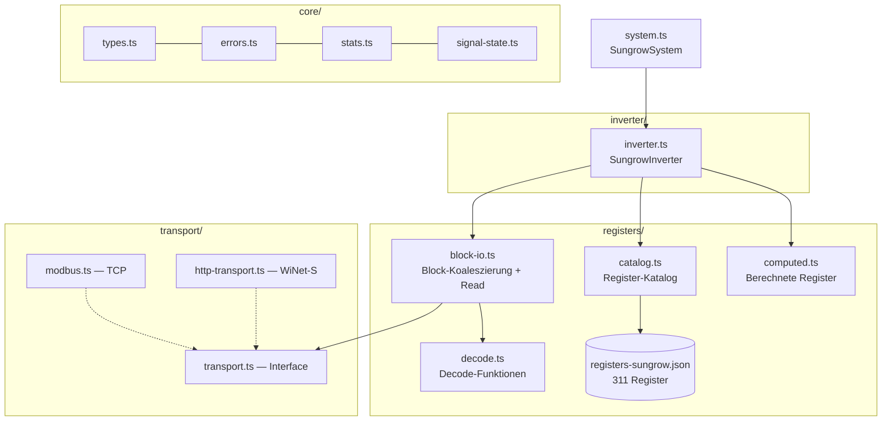
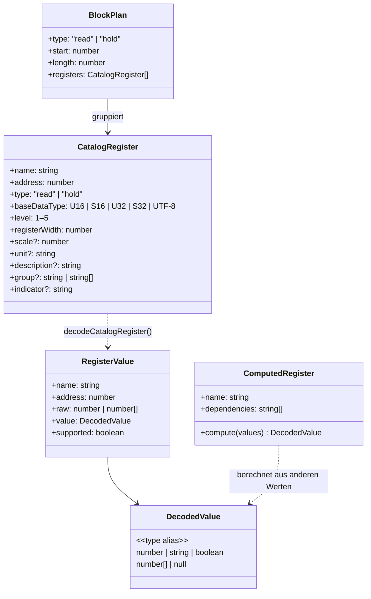
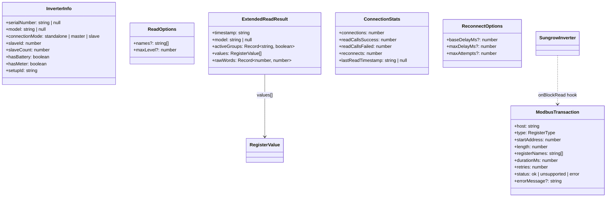
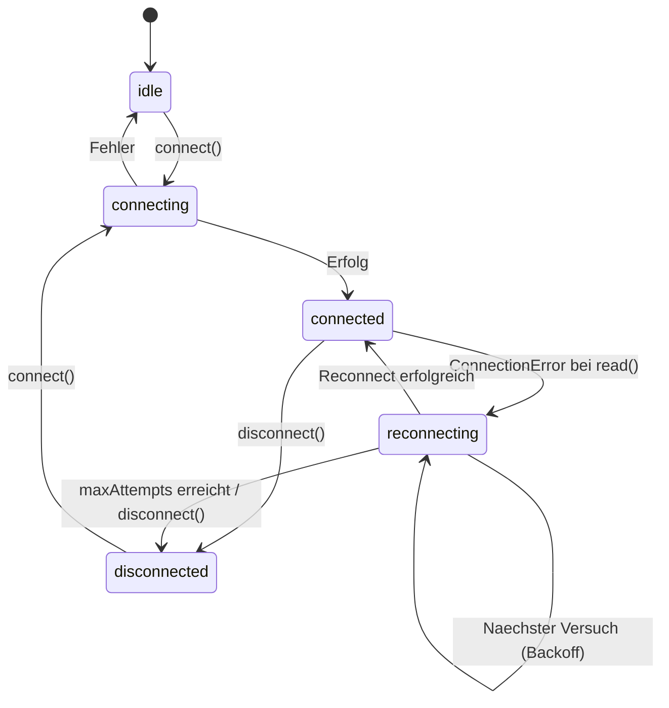
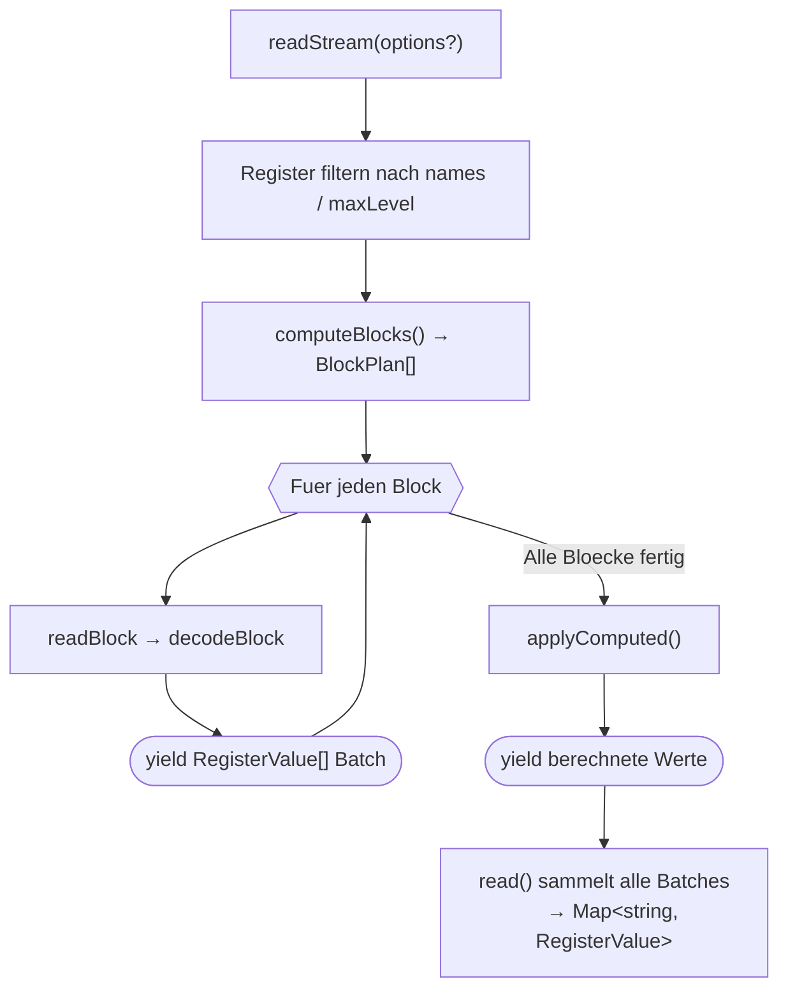
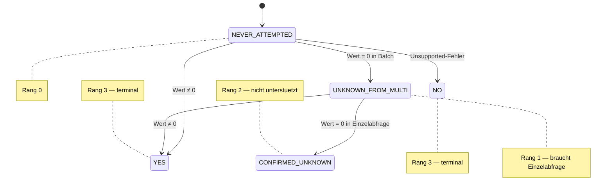
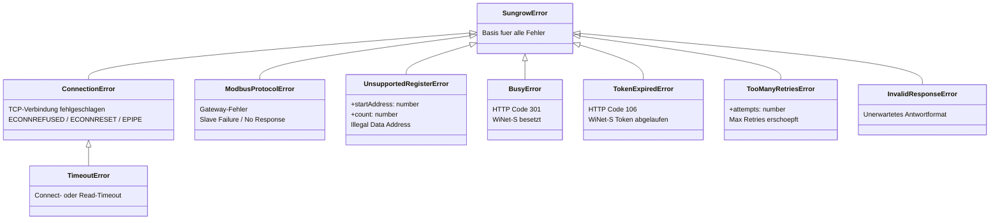
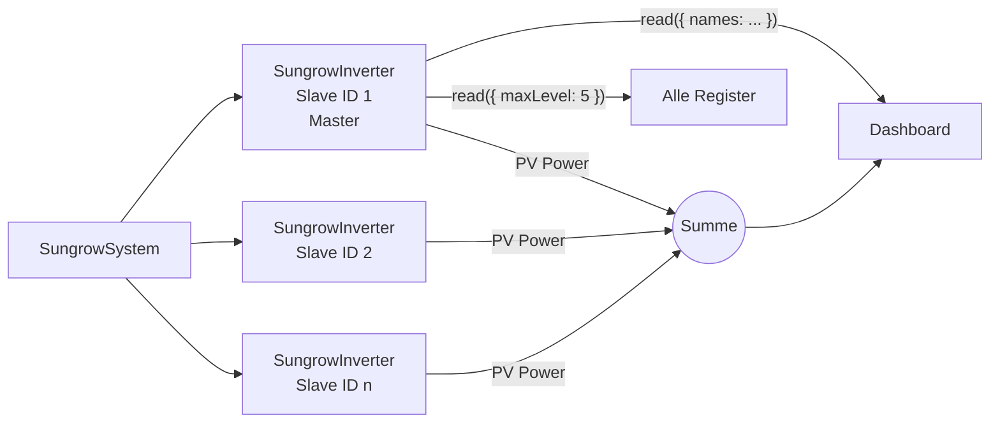
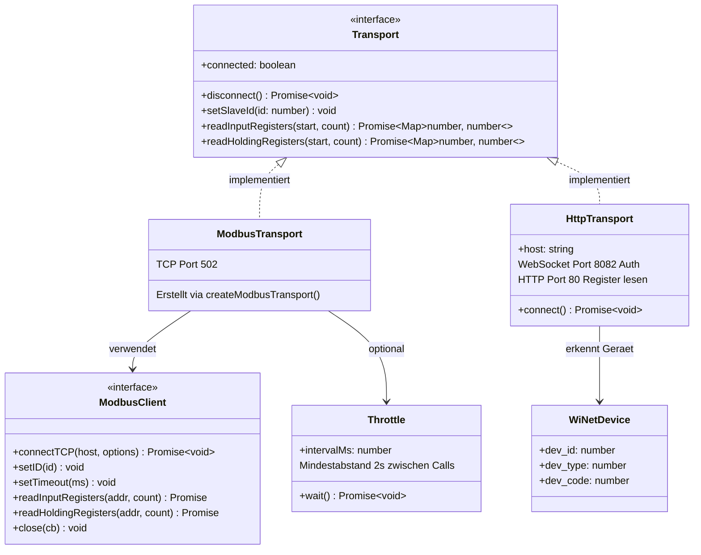

# Sungrow-Modul Architektur

Extrahierbares Modul fuer die Kommunikation mit Sungrow-Hybrid-Wechselrichtern (SH-RT Serie) ueber Modbus TCP. Unabhaengig vom SmartHome-Adapter-Interface nutzbar.

## Modulstruktur



Die gestrichelten Pfeile zeigen „implementiert". Die durchgezogenen zeigen „benutzt".

## Datentypen

### Register-Pipeline

Wie ein Register vom JSON-Katalog zum dekodierten Wert wird:



### API-Typen

Typen die der Caller (Adapter/App) bekommt und uebergibt:



## Verbindungs-Lebenszyklus

### Connection State Machine



### Zwei-Stufen-Reconnect

```
Block-Read schlaegt fehl
  └→ readBlock Retry bis 4× (schneller TCP-Reconnect, ~5s je Versuch)
      ├→ Erfolg: readStream liest naechsten Block, Caller merkt nichts
      └→ Alle Retries fehlgeschlagen: ConnectionError wird geworfen
          └→ readStream bricht ab, Fehler propagiert zu SungrowSystem.read()
              └→ System plant Hintergrund-Reconnect (exponentieller Backoff)
                  ├→ Erfolg: state → 'connected', naechster Poll funktioniert
                  └→ maxAttempts: state → 'disconnected', Adapter informiert
```

**Stufe 1 — Transport-Reconnect** (in `readBlock` via `SungrowInverter.reconnectTransport()`): Nur neue TCP-Verbindung + Slave-ID setzen. Keine Model/Gruppen-Erkennung. Schnell (~5s).

**Stufe 2 — System-Reconnect** (in `SungrowSystem.doReconnect()`): Neue Inverter-Instanzen, volle Erkennung (Model, Gruppen, Master/Slave-Topologie). Exponentieller Backoff (base × 2^attempt, gedeckelt bei maxDelay).

### API

```typescript
const system = new SungrowSystem({
  hosts: [host],
  logger,
  reconnect: { baseDelayMs: 5000, maxDelayMs: 60000 },
  onStateChange: (state, detail) => {
    console.log(`${state}: ${detail}`);
  },
});
await system.connect();
// system.state === 'connected'
// Bei ConnectionError: system.state → 'reconnecting' → 'connected'
```

## Ein Lese-Pfad, Caller entscheidet

Das Modul hat eine einzige `read(options?)` Methode. Der Caller (Adapter/App) bestimmt per `ReadOptions`, welche Register gelesen werden:


### API

```typescript
const system = new SungrowSystem({ hosts: [host], logger });
await system.connect();  // Model + Groups einmal erkennen und cachen

// Caller entscheidet was gelesen wird:
const data = await system.read({ names: ['total_dc_power', 'battery_soc'] });
const data = await system.read({ maxLevel: 3 });
const data = await system.read();  // alles

// data: ReadResult ({ values: Map<string, RegisterValue>, transactions: ModbusTransaction[] })
// system.lastRawWords        — Diagnostik
// system.lastValues          — RegisterValue[] fuer UI
// onBlockRead hook           — ModbusTransaction per Modbus-Block (Timing, Status, Retries)
```

### Datenfluss

```mermaid
sequenceDiagram
    participant App as Adapter/App
    participant Sys as SungrowSystem
    participant Cat as RegisterCatalog
    participant MB as ModbusClient

    App->>Sys: connect()
    Sys->>MB: connect TCP
    Sys->>MB: read device_type_code
    Sys->>Cat: filterByModel(model)
    Sys->>MB: read group indicators
    Note over Sys: Model + Groups gecached

    loop 10s Poll
        App->>Sys: read({ names: [...] })
        Sys->>Cat: resolve names → CatalogRegister[]
        Sys->>Sys: computeBlocks()
        Sys->>MB: readBlock() × N
        Sys->>Sys: decodeBlock()
        Sys-->>App: Map&lt;string, RegisterValue&gt;
        App->>App: composeSystemReading(data)
    end

    loop 5min Dump
        App->>Sys: read({ maxLevel: 5 })
        Note over Sys: Gleicher Pfad, mehr Register
        Sys-->>App: Map&lt;string, RegisterValue&gt;
        App->>App: lastRawWords fuer Dump, lastValues fuer UI
    end
```

### Gruppen-System

Zwei JSON-Felder steuern Feature-Gruppen:

- **`group`** (string | string[]) — Register gehoert zu dieser Gruppe(n). `filterByGroups()` in `catalog.ts` prueft `activeGroups[g] === true` fuer alle eingetragenen Gruppen.
- **`indicator`** (string) — Register ist der Detektor fuer die genannte Gruppe. `detectGroups()` in `inverter.ts` liest Indikator-Register einzeln beim `connect()` via `transport.readInputRegisters()`.

Fluss bei `connect()`:

```
1. filterByModel(model) → applicable registers (vor Gruppen-Filter!)
2. detectGroups(applicable): fuer jedes Register mit indicator ≠ null
   → einzeln via Transport lesen
   → Wert 0 oder 0xFFFF oder Error → Gruppe = false
   → sonst → Gruppe = true
   → cachedActiveGroups: true-Werte aus Cache ueberschreiben false
3. filterByGroups(applicable, activeGroups) → _applicableRegisters
```

Alle Reads bei connect() (Slave-Probe, Serial, Model, Indikatoren, OutputType, MasterSlave) erzeugen `ModbusTransaction` mit `reason: 'connect'` ueber den `onBlockRead`-Hook.

Gruppen und ihre Indikatoren:

| Gruppe | Indikator-Register | Bemerkung |
|---|---|---|
| has_battery | battery_capacity | |
| has_meter | meter_active_power | |
| is_master | total_import_energy | |
| direct_lan | array_insulation_resistance | WiNet vs. LAN |
| mppt2–mppt12 | mppt_N_current | nachts unzuverlaessig (Strom=0) |

Register mit mehreren Gruppen (Array): z.B. `group: ["mppt4", "direct_lan"]` — mppt4-12 Indikatoren/Register sind nur ueber Direct-LAN lesbar. Array-Syntax stellt sicher, dass Register auch bei gecachtem `mppt4=true` gefiltert werden wenn `direct_lan=false`.

Beteiligte Dateien:
- `registers-sungrow.json` — Gruppen-Definitionen (group, indicator)
- `catalog.ts` — `filterByGroups()`, `getGroupIndicators()`
- `inverter.ts` — `detectGroups()`
- `core/types.ts` — `CatalogRegister.group`, `CatalogRegister.indicator`, `RegisterValue.group`, `RegisterValue.indicator`
- `block-io.ts` — `decodeBlock()` propagiert group/indicator in RegisterValue

### Progressives Streaming (readStream)

`readStream()` ist ein AsyncGenerator, der `RegisterValue[]`-Batches yielded, waehrend die Modbus-Bloecke gelesen werden. `read()` ist ein Convenience-Wrapper, der alle Batches sammelt.



`readStream()` yielded `RegisterValue[]`-Batches pro Modbus-Block — fuer UIs die inkrementell anzeigen wollen. `read()` ist der Normalfall: sammelt alles und gibt eine flache `Map&lt;string, RegisterValue&gt;` zurueck (wie im Datenfluss-Diagramm oben).

## Register-Katalog

`registers-sungrow.json` enthaelt 311 Register (229 Input, 82 Holding), urspruenglich konvertiert aus der Python-Referenz (`homeassistant-sungrow`) und gegen die offiziellen Sungrow-Kommunikationsprotokolle (V1.0.20–V1.1.9) auditiert. Jeder Eintrag hat:

- **name**: Eindeutiger Bezeichner (Duplikate durch `_`-Suffix aufgeloest)
- **address**: 1-basierte Sungrow-Adresse
- **data_type**: `U16`, `S16`, `U32`, `S32`, `UTF-8`, Arrays wie `U16[96]`
- **level** 1-5: Verbindung → Energie → Erweitert → Detail → Debug
- **group**: string oder string[] — Feature-Gruppe(n). Register wird nur gelesen wenn **alle** Gruppen aktiv (`=== true`). Beispiele: `"has_battery"`, `["mppt4", "direct_lan"]`. Gruppen: `has_battery`, `has_meter`, `is_master`, `direct_lan`, `mppt2`–`mppt12`.
- **indicator**: string — Dieses Register ist der Detektor fuer die genannte Gruppe. Wird einzeln bei `connect()` gelesen um die Gruppe zu erkennen. Beispiel: `battery_capacity` hat `indicator: "has_battery"`.
- **models/models_exclude**: fnmatch-Patterns fuer Model-Filterung
- **decoded**: Wert→String-Map (z.B. `{0: "Stop", 32768: "Run"}`)
- **mask**: Bitmask fuer Boolean-Extraktion aus geteilten Registern
- **accuracy/scale**: Skalierungsfaktor
- **unsupported_value**: Wert der "nicht unterstuetzt" signalisiert
- **description**: Optionale Beschreibung aus den offiziellen Sungrow-PDFs (z.B. "Recommended instead of 13022")

### Level-Hierarchie

| Level | Name | Beschreibung |
|-------|------|-------------|
| 1 | Verbindung | Model, Seriennummer, Firmware |
| 2 | Energie-Dashboard | PV, Batterie, Netz, Verbrauch |
| 3 | Erweitert | Temperaturen, Spannungen, Stroeme |
| 4 | Detaildaten | MPPT-Details, Tages-/Gesamtzaehler |
| 5 | Debug | Alarm-Codes, interne Zustaende |

### Runtime-Filterung

Alle Filterung passiert zur Laufzeit, einmal beim `connect()` und dann pro `read()`:

1. **Model-Filter** (connect): `fnmatch(model, pattern)` mit `*`-Wildcards
2. **Model-Overrides** (connect): Bekannte Diskrepanzen korrigieren (SH8.0RT-20: S32→S16)
3. **Gruppen-Filter** (connect): Gruppen-Indikatoren per Modbus lesen, inaktive Features ausblenden
4. **Level-Filter** (read): `maxLevel` Option filtert
5. **Namen-Filter** (read): `names` Option waehlt explizite Register

## Block-Koaleszierung

Register werden nach Typ (Input/Holding) getrennt, nach Adresse sortiert und zu Bloecken zusammengefasst:

- Max. 125 Register pro Modbus-Request (Protokoll-Limit)
- Luecken bis 10 Register werden toleriert (ein Read statt zwei)
- Zu grosse Bloecke werden an Register-Grenzen gesplittet

## Decode-Funktionen

| Funktion | Eingabe | Ausgabe |
|----------|---------|---------|
| `decodeRawScalar` | U16/S16/U32/S32 | `number` |
| `decodeUtf8` | UTF-8 Register | `string` |
| `decodeArray` | U16[n]/U32[n] | `number[]` |
| `applyMask` | Rohwert + Bitmask | `boolean` |
| `lookupDecoded` | Rohwert + Map | `string \| number` |
| `isUnsupported` | Rohwert + Schwellwert | `boolean` |
| `decodeCatalogRegister` | CatalogRegister + Daten | `{raw, value, supported}` |

## Signal-Zustandsmaschine

Sungrow-Wechselrichter geben in Batch-Queries `0` fuer nicht-unterstuetzte Register zurueck — genau wie fuer echte Null-Werte. Der `SignalStateTracker` loest diese Mehrdeutigkeit ueber mehrere Lesezyklen auf:



Ranking-Regel: Ein Zustand kann nur auf gleichen oder hoeheren Rang wechseln. `YES` und `NO` sind terminal. `getPendingVerifications()` liefert alle Signale im Zustand `UNKNOWN_FROM_MULTI`, die eine Einzelabfrage brauchen.

## Fehler-Hierarchie



`wrapModbusError(err)` klassifiziert rohe `modbus-serial`-Exceptions anhand von Fehlermeldungs-Patterns in die passende Unterklasse.

## Master/Slave-Setup



- Slave ID 1 = Master (hat Grid, Batterie, Load, alle Meter-Daten)
- Slave ID 2+ = Slaves (nur eigene PV-Leistung)
- `SungrowSystem.read()` liest vom Master
- `SungrowSystem.readSlaves()` liest von Slaves (z.B. fuer PV-Summierung)
- PV-Summierung ist App-Logik im Adapter, nicht in der Lib
- Master/Slave-Erkennung ueber Katalog-Register (decoded Maps: `'Enabled'`, `'Master'`)

## Transport-Interface

Zwei Implementierungen hinter einem gemeinsamen Interface. `readBlock()` und `SungrowInverter` arbeiten nur mit dem Interface, nie direkt mit ModbusClient oder HTTP.



## Modbus-Konventionen

- Adressen sind 1-basiert (Sungrow-Doku-Konvention)
- PDU-Adresse = Adresse - 1 (in `modbus.ts` gehandelt)
- Word Order: **Little-Endian** (Low-Word an niedrigerer Adresse)
- NA-Werte: `0xFFFF` (U16), `0x7FFF` (S16), `0xFFFFFFFF` (U32), `0x7FFFFFFF` (S32)
- Protokoll: TCP Port 502, `modbus-serial` Library

## Raw Register Storage

`solar_register_dumps` speichert alle 5 Minuten den kompletten Raw-Dump:

```
{address: raw_16bit_word, ...}  →  JSON in SQLite
```

Ermoeglicht:
- Nachtraegliches Testen neuer Decode-Logik gegen echte Daten
- Plausibilisierung bei Verdacht auf fehlerhafte Dekodierung
- Historische Analyse ohne laufenden Inverter

## Verzeichnisstruktur

```
src/
  index.ts                          Public API Exports
  system.ts                         SungrowSystem (Multi-Inverter, Auto-Discovery)
  core/                             Grundbausteine (Typen, Fehler, Stats)
    types.ts                        Reine Typen (CatalogRegister, DecodedValue, ReadOptions, ...)
    errors.ts                       Fehler-Hierarchie (SungrowError → 8 Subklassen)
    stats.ts                        ConnectionStats
    signal-state.ts                 SignalStateTracker (5-Zustands-Maschine)
  transport/                        Datenuebertragung (Modbus TCP, WiNet-S HTTP)
    transport.ts                    Transport-Interface
    modbus.ts                       ModbusClient-Wrapper, Throttle, createModbusTransport
    http-transport.ts               WiNet-S HTTP/WebSocket-Transport
    modbus-serial.d.ts              Type-Declaration fuer Peer-Dep
  registers/                        Register-Definitionen und Dekodierung
    catalog.ts                      RegisterCatalog, loadCatalog, fnmatch, Model-Overrides
    decode.ts                       Deserialisierung (Skalar, UTF-8, Array, Mask, Sentinel)
    block-io.ts                     Block-Koaleszierung, readBlock mit Retry, ProblematicRegisters
    computed.ts                     ComputedRegister (Timestamp, Alarm, MPPT Power)
    registers-sungrow.json          Vollstaendiger Register-Katalog (311 Register)
  inverter/                         Single-Inverter
    inverter.ts                     SungrowInverter
```

## Tests

Alle Tests in `*.test.ts` im selben Verzeichnis wie die Quelldatei. Kein `modbus-serial` noetig — alle Tests nutzen Mocks.

| Test | Abdeckung |
|------|-----------|
| `core/errors.test.ts` | Fehler-Hierarchie, wrapModbusError |
| `core/signal-state.test.ts` | Zustandsuebergaenge, Ranking, Pending-Verifications |
| `transport/modbus.test.ts` | Block-Reads, Adress-Offset (-1) |
| `transport/http-transport.test.ts` | WiNet-S Protokoll, Token-Management, Retry |
| `registers/decode.test.ts` | decodeRawScalar (inkl. S32 0x7FFFFFFF Sentinel), UTF-8, Arrays, Masken, Decoded-Maps |
| `registers/catalog.test.ts` | JSON-Laden, fnmatch, Model-/Level-/Gruppen-Filterung, Overrides |
| `registers/block-io.test.ts` | Block-Koaleszierung, Retry, ProblematicRegisters |
| `registers/computed.test.ts` | Computed Registers (Timestamp, MPPT Power) |
| `inverter/inverter.test.ts` | connect (Model/Groups/Master-Slave), read() mit Names/Level |
| `inverter/integration.test.ts` | Volle Pipeline: Transport → Katalog → Block-IO → Decode → Computed |
| `system.test.ts` | SungrowSystem: Multi-Host, Auto-Discovery, Parallel-Connect, Reconnect |
| `cli/cli.test.ts` | Alle CLI-Commands mit Fake-Inverter |

## Conformance Tests

Sprachuebergreifendes Testsystem unter `conformance/`. Validiert beliebige sungrowlib-Implementierungen gegen denselben Standard — unabhaengig von der Programmiersprache.

```
conformance/
  fixtures/               Wiederverwendbare Register-Sets aus echten Dumps
  scenarios/               17 YAML-Szenarien (detect, read, system, error)
  simulator/               Modbus TCP Simulator (Python asyncio, kein pymodbus)
  runner/                  Test-Orchestrator (Python)
  README.md                Ausfuehrliche Doku
```

Architektur: Runner startet Simulator → ruft CLI mit `--format json` → vergleicht JSON-Output mit YAML-Erwartungen. Pro Szenario ein eigener Port-Bereich, 148 Checks total.

CLI-Vertrag fuer neue Implementierungen: `info`/`read` mit `--format json`, Multi-Host via mehrere `-H host:port`. Siehe `conformance/README.md`.
