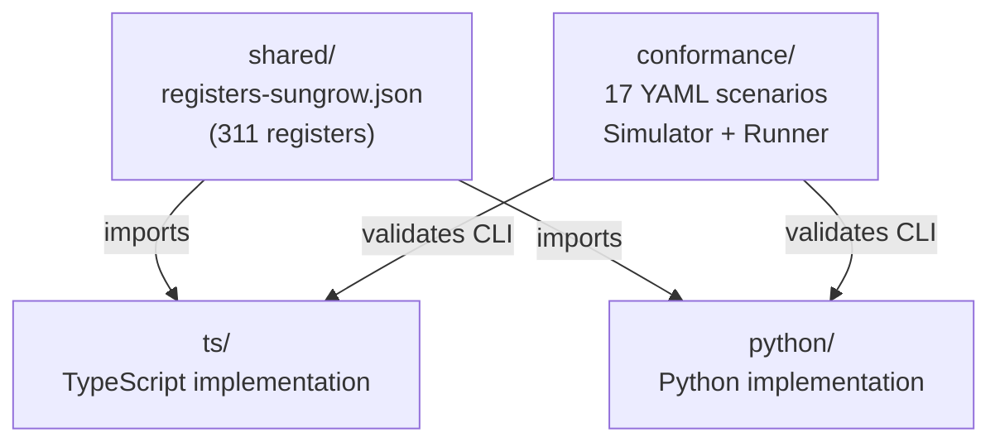
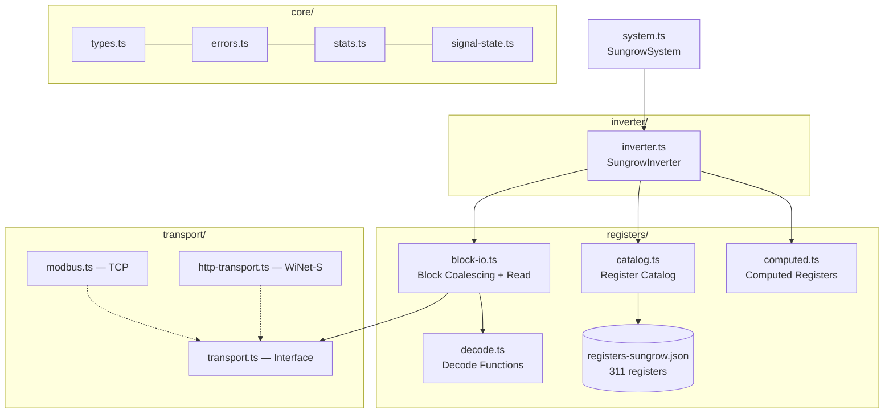
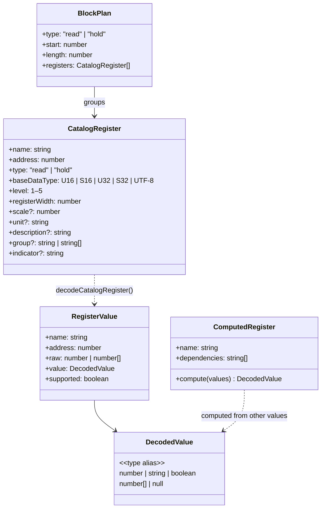
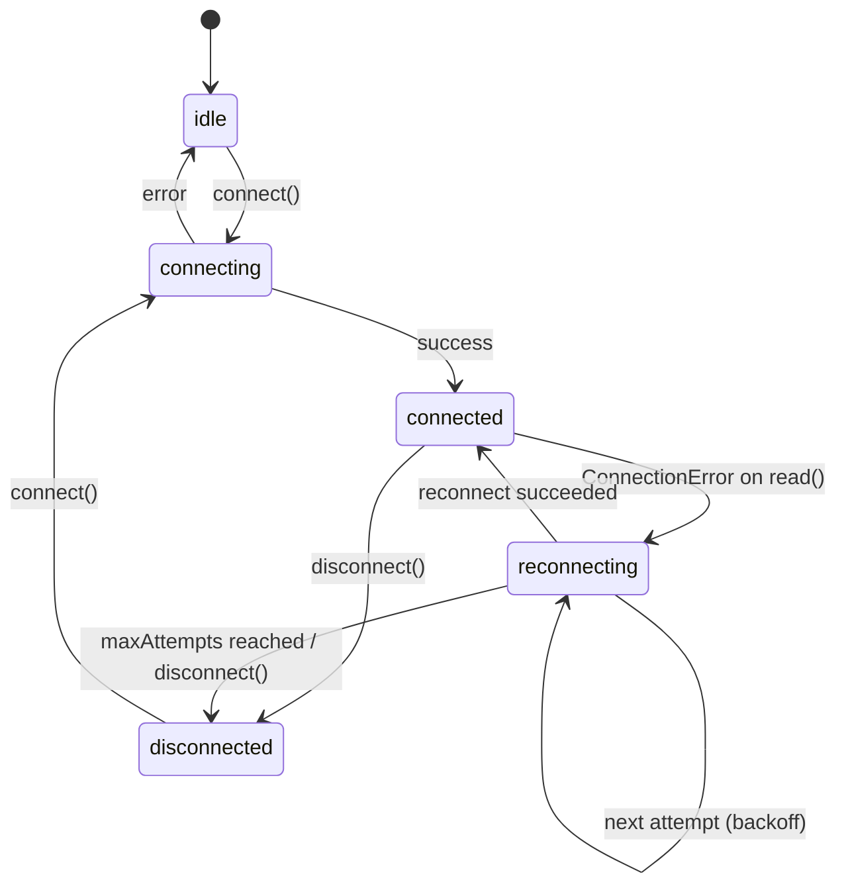
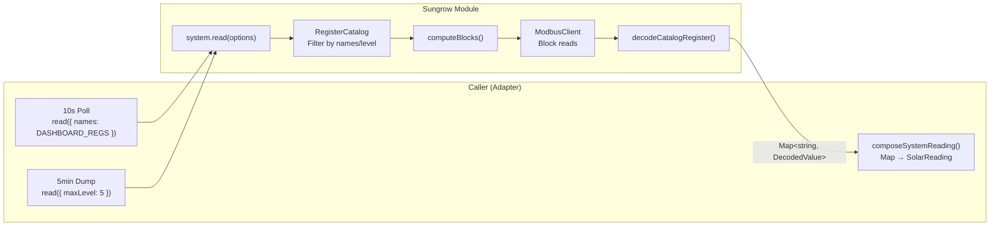
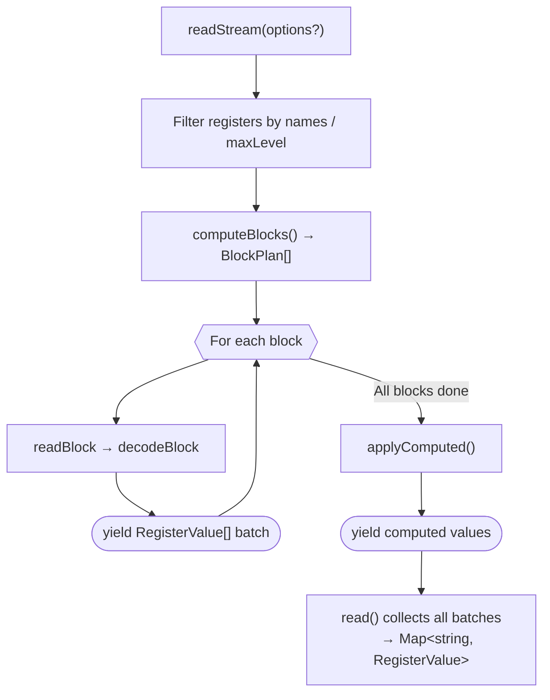
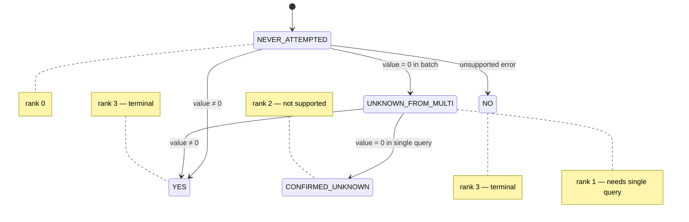
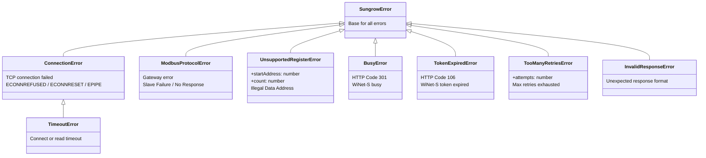
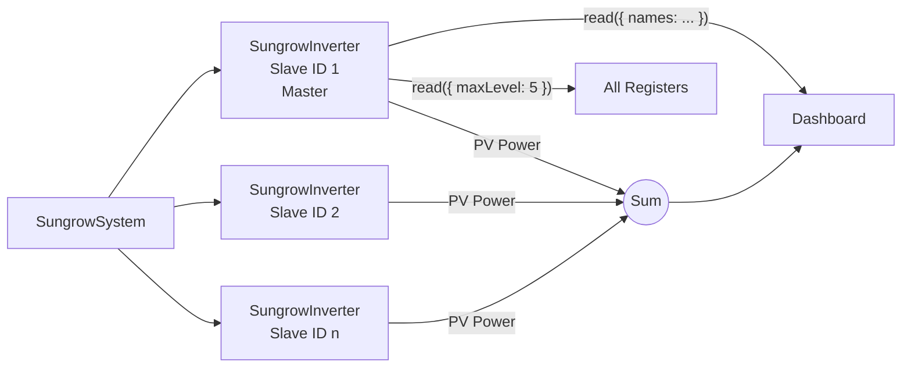
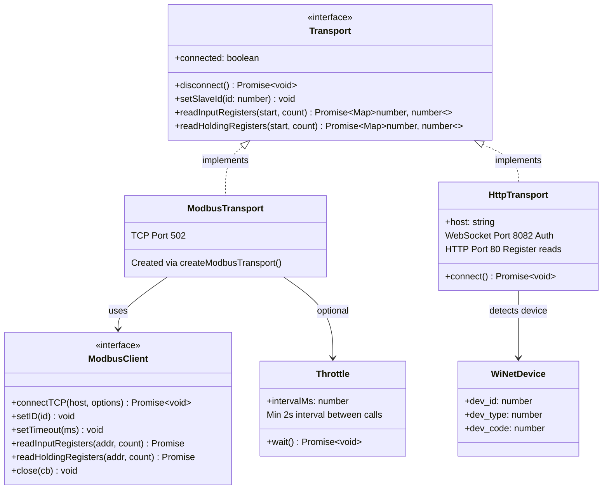

# Sungrow Module Architecture

## Monorepo Structure



Each implementation lives in its own directory with its own build/test configuration. The shared register JSON (`shared/registers-sungrow.json`) is the canonical data source. The conformance tests (`conformance/`) validate all implementations against the same standard.

---

## TypeScript Module Structure

Extractable module for communication with Sungrow hybrid inverters (SH-RT series) via Modbus TCP. Usable independently of any SmartHome adapter interface.

## Module Structure



Dashed arrows indicate "implements". Solid arrows indicate "uses".

## Data Types

### Register Pipeline

How a register goes from the JSON catalog to a decoded value:



### API Types

Types the caller (adapter/app) receives and passes:


## Connection Lifecycle

### Connection State Machine



### Two-Tier Reconnect

```
Block read fails
  └→ readBlock retry up to 4× (fast TCP reconnect, ~5s per attempt)
      ├→ Success: readStream reads next block, caller unaware
      └→ All retries failed: ConnectionError thrown
          └→ readStream aborts, error propagates to SungrowSystem.read()
              └→ System schedules background reconnect (exponential backoff)
                  ├→ Success: state → 'connected', next poll works
                  └→ maxAttempts: state → 'disconnected', adapter notified
```

**Tier 1 — Transport Reconnect** (in `readBlock` via `SungrowInverter.reconnectTransport()`): New TCP connection + set slave ID only. No model/group detection. Fast (~5s).

**Tier 2 — System Reconnect** (in `SungrowSystem.doReconnect()`): New inverter instances, full detection (model, groups, master/slave topology). Exponential backoff (base × 2^attempt, capped at maxDelay).

### API

```typescript
const system = new SungrowSystem({
  hosts: [host],
  logger,
  reconnect: { baseDelayMs: 5000, maxDelayMs: 60000 },
  onStateChange: (state, detail) => {
    console.log(`${state}: ${detail}`);
  },
});
await system.connect();
// system.state === 'connected'
// On ConnectionError: system.state → 'reconnecting' → 'connected'
```

## Single Read Path, Caller Decides

The module has a single `read(options?)` method. The caller (adapter/app) controls which registers are read via `ReadOptions`:



### API

```typescript
const system = new SungrowSystem({ hosts: [host], logger });
await system.connect();  // detect model + groups once and cache

// Caller decides what to read:
const data = await system.read({ names: ['total_dc_power', 'battery_soc'] });
const data = await system.read({ maxLevel: 3 });
const data = await system.read();  // everything

// data: ReadResult ({ values: Map<string, RegisterValue>, transactions: ModbusTransaction[] })
// system.lastRawWords        — diagnostics
// system.lastValues          — RegisterValue[] for UI
// onBlockRead hook           — ModbusTransaction per Modbus block (timing, status, retries)
```

### Data Flow

```mermaid
sequenceDiagram
    participant App as Adapter/App
    participant Sys as SungrowSystem
    participant Cat as RegisterCatalog
    participant MB as ModbusClient

    App->>Sys: connect()
    Sys->>MB: connect TCP
    Sys->>MB: read device_type_code
    Sys->>Cat: filterByModel(model)
    Sys->>MB: read group indicators
    Note over Sys: Model + groups cached

    loop 10s Poll
        App->>Sys: read({ names: [...] })
        Sys->>Cat: resolve names → CatalogRegister[]
        Sys->>Sys: computeBlocks()
        Sys->>MB: readBlock() × N
        Sys->>Sys: decodeBlock()
        Sys-->>App: Map&lt;string, RegisterValue&gt;
        App->>App: composeSystemReading(data)
    end

    loop 5min Dump
        App->>Sys: read({ maxLevel: 5 })
        Note over Sys: Same path, more registers
        Sys-->>App: Map&lt;string, RegisterValue&gt;
        App->>App: lastRawWords for dump, lastValues for UI
    end
```

### Group System

Two JSON fields control feature groups:

- **`group`** (string | string[]) — Register belongs to this group(s). `filterByGroups()` in `catalog.ts` checks `activeGroups[g] === true` for all listed groups.
- **`indicator`** (string) — Register is the detector for the named group. `detectGroups()` in `inverter.ts` reads indicator registers individually during `connect()` via `transport.readInputRegisters()`.

Flow during `connect()`:

```
1. filterByModel(model) → applicable registers (before group filtering!)
2. detectGroups(applicable): for each register with indicator ≠ null
   → read individually via transport
   → value 0 or 0xFFFF or error → group = false
   → otherwise → group = true
   → cachedActiveGroups: true values from cache override false
3. filterByGroups(applicable, activeGroups) → _applicableRegisters
```

All reads during connect() (slave probe, serial, model, indicators, output type, master/slave) produce `ModbusTransaction` with `reason: 'connect'` via the `onBlockRead` hook.

Groups and their indicators:

| Group | Indicator Register | Notes |
|---|---|---|
| has_battery | battery_capacity | |
| has_meter | meter_active_power | |
| is_master | total_import_energy | |
| direct_lan | array_insulation_resistance | WiNet vs. LAN |
| mppt2–mppt12 | mppt_N_current | unreliable at night (current=0) |

Registers with multiple groups (array): e.g. `group: ["mppt4", "direct_lan"]` — mppt4-12 indicators/registers are only readable via direct LAN. Array syntax ensures registers are filtered even when cached `mppt4=true` if `direct_lan=false`.

Relevant files:
- `registers-sungrow.json` — group definitions (group, indicator)
- `catalog.ts` — `filterByGroups()`, `getGroupIndicators()`
- `inverter.ts` — `detectGroups()`
- `core/types.ts` — `CatalogRegister.group`, `CatalogRegister.indicator`, `RegisterValue.group`, `RegisterValue.indicator`
- `block-io.ts` — `decodeBlock()` propagates group/indicator into RegisterValue

### Progressive Streaming (readStream)

`readStream()` is an AsyncGenerator that yields `RegisterValue[]` batches as Modbus blocks are read. `read()` is a convenience wrapper that collects all batches.



`readStream()` yields `RegisterValue[]` batches per Modbus block — for UIs that want incremental display. `read()` is the normal case: collects everything and returns a flat `Map<string, RegisterValue>` (as in the data flow diagram above).

## Register Catalog

`registers-sungrow.json` contains 311 registers (229 input, 82 holding), originally converted from the Python reference (`homeassistant-sungrow`) and audited against the official Sungrow communication protocols (V1.0.20–V1.1.9). Each entry has:

- **name**: Unique identifier (duplicates resolved via `_` suffix)
- **address**: 1-based Sungrow address
- **data_type**: `U16`, `S16`, `U32`, `S32`, `UTF-8`, arrays like `U16[96]`
- **level** 1-5: Connection → Energy → Extended → Detail → Debug
- **group**: string or string[] — feature group(s). Register is only read when **all** groups are active (`=== true`). Examples: `"has_battery"`, `["mppt4", "direct_lan"]`. Groups: `has_battery`, `has_meter`, `is_master`, `direct_lan`, `mppt2`–`mppt12`.
- **indicator**: string — This register is the detector for the named group. Read individually during `connect()` to detect the group. Example: `battery_capacity` has `indicator: "has_battery"`.
- **models/models_exclude**: fnmatch patterns for model filtering
- **decoded**: value→string map (e.g. `{0: "Stop", 32768: "Run"}`)
- **mask**: bitmask for boolean extraction from shared registers
- **accuracy/scale**: scaling factor
- **unsupported_value**: value that signals "not supported"
- **description**: Optional description from the official Sungrow PDFs (e.g. "Recommended instead of 13022")

### Level Hierarchy

| Level | Name | Description |
|-------|------|-------------|
| 1 | Connection | Model, serial number, firmware |
| 2 | Energy Dashboard | PV, battery, grid, consumption |
| 3 | Extended | Temperatures, voltages, currents |
| 4 | Detail Data | MPPT details, daily/total counters |
| 5 | Debug | Alarm codes, internal states |

### Runtime Filtering

All filtering happens at runtime, once during `connect()` and then per `read()`:

1. **Model filter** (connect): `fnmatch(model, pattern)` with `*` wildcards
2. **Model overrides** (connect): correct known discrepancies (SH8.0RT-20: S32→S16)
3. **Group filter** (connect): read group indicators via Modbus, hide inactive features
4. **Level filter** (read): `maxLevel` option filters
5. **Name filter** (read): `names` option selects explicit registers

## Block Coalescing

Registers are separated by type (input/holding), sorted by address, and combined into blocks:

- Max 125 registers per Modbus request (protocol limit)
- Gaps up to 10 registers are tolerated (one read instead of two)
- Oversized blocks are split at register boundaries

## Decode Functions

| Function | Input | Output |
|----------|-------|--------|
| `decodeRawScalar` | U16/S16/U32/S32 | `number` |
| `decodeUtf8` | UTF-8 registers | `string` |
| `decodeArray` | U16[n]/U32[n] | `number[]` |
| `applyMask` | raw value + bitmask | `boolean` |
| `lookupDecoded` | raw value + map | `string \| number` |
| `isUnsupported` | raw value + threshold | `boolean` |
| `decodeCatalogRegister` | CatalogRegister + data | `{raw, value, supported}` |

## Signal State Machine

Sungrow inverters return `0` for unsupported registers in batch queries — same as for actual zero values. The `SignalStateTracker` resolves this ambiguity over multiple read cycles:



Ranking rule: A state can only transition to the same or higher rank. `YES` and `NO` are terminal. `getPendingVerifications()` returns all signals in state `UNKNOWN_FROM_MULTI` that need a single query.

## Error Hierarchy



`wrapModbusError(err)` classifies raw `modbus-serial` exceptions by error message patterns into the appropriate subclass.

## Master/Slave Setup



- Slave ID 1 = Master (has grid, battery, load, all meter data)
- Slave ID 2+ = Slaves (only own PV power)
- `SungrowSystem.read()` reads from master
- `SungrowSystem.readSlaves()` reads from slaves (e.g. for PV summation)
- PV summation is app logic in the adapter, not in the lib
- Master/slave detection via catalog registers (decoded maps: `'Enabled'`, `'Master'`)

## Transport Interface

Two implementations behind a common interface. `readBlock()` and `SungrowInverter` only work with the interface, never directly with ModbusClient or HTTP.



## Modbus Conventions

- Addresses are 1-based (Sungrow documentation convention)
- PDU address = address - 1 (handled in `modbus.ts`)
- Word order: **little-endian** (low word at lower address)
- N/A values: `0xFFFF` (U16), `0x7FFF` (S16), `0xFFFFFFFF` (U32), `0x7FFFFFFF` (S32)
- Protocol: TCP port 502, `modbus-serial` library

## Raw Register Storage

`solar_register_dumps` stores the complete raw dump every 5 minutes:

```
{address: raw_16bit_word, ...}  →  JSON in SQLite
```

Enables:
- Retroactive testing of new decode logic against real data
- Plausibility checks when faulty decoding is suspected
- Historical analysis without a running inverter

## Directory Structure

```
ts/src/
  index.ts                          Public API exports
  system.ts                         SungrowSystem (multi-inverter, auto-discovery)
  core/                             Fundamentals (types, errors, stats)
    types.ts                        Pure types (CatalogRegister, DecodedValue, ReadOptions, ...)
    errors.ts                       Error hierarchy (SungrowError → 8 subclasses)
    stats.ts                        ConnectionStats
    signal-state.ts                 SignalStateTracker (5-state machine)
  transport/                        Data transport (Modbus TCP, WiNet-S HTTP)
    transport.ts                    Transport interface
    modbus.ts                       ModbusClient wrapper, Throttle, createModbusTransport
    http-transport.ts               WiNet-S HTTP/WebSocket transport
    modbus-serial.d.ts              Type declaration for peer dep
  registers/                        Register definitions and decoding
    catalog.ts                      RegisterCatalog, loadCatalog, fnmatch, model overrides
    decode.ts                       Deserialization (scalar, UTF-8, array, mask, sentinel)
    block-io.ts                     Block coalescing, readBlock with retry, ProblematicRegisters
    computed.ts                     ComputedRegister (timestamp, alarm, MPPT power)
  inverter/                         Single inverter
    inverter.ts                     SungrowInverter
shared/
  registers-sungrow.json            Complete register catalog (311 registers)
```

## Tests

All tests in `*.test.ts` co-located with the source file. No `modbus-serial` needed — all tests use mocks.

| Test | Coverage |
|------|----------|
| `core/errors.test.ts` | Error hierarchy, wrapModbusError |
| `core/signal-state.test.ts` | State transitions, ranking, pending verifications |
| `transport/modbus.test.ts` | Block reads, address offset (-1) |
| `transport/http-transport.test.ts` | WiNet-S protocol, token management, retry |
| `registers/decode.test.ts` | decodeRawScalar (incl. S32 0x7FFFFFFF sentinel), UTF-8, arrays, masks, decoded maps |
| `registers/catalog.test.ts` | JSON loading, fnmatch, model/level/group filtering, overrides |
| `registers/block-io.test.ts` | Block coalescing, retry, ProblematicRegisters |
| `registers/computed.test.ts` | Computed registers (timestamp, MPPT power) |
| `inverter/inverter.test.ts` | connect (model/groups/master-slave), read() with names/level |
| `inverter/integration.test.ts` | Full pipeline: transport → catalog → block-IO → decode → computed |
| `system.test.ts` | SungrowSystem: multi-host, auto-discovery, parallel connect, reconnect |
| `cli/cli.test.ts` | All CLI commands with fake inverter |

## Conformance Tests

Cross-language test system under `conformance/`. Validates any sungrowlib implementation against the same standard — regardless of programming language.

```
conformance/
  fixtures/               Reusable register sets from real dumps
  scenarios/               17 YAML scenarios (detect, read, system, error)
  simulator/               Modbus TCP simulator (Python asyncio, no pymodbus)
  runner/                  Test orchestrator (Python)
  README.md                Detailed documentation
```

Architecture: Runner starts simulator → invokes CLI with `--format json` → compares JSON output against YAML expectations. Each scenario gets its own port range, 148 checks total.

CLI contract for new implementations: `info`/`read` with `--format json`, multi-host via multiple `-H host:port`. See `conformance/README.md`.
