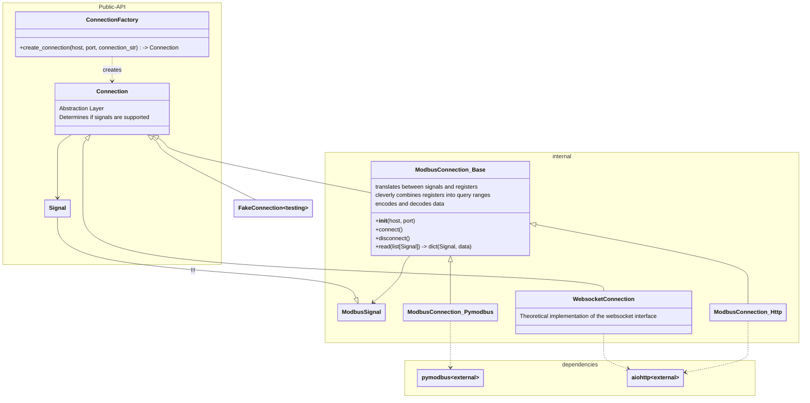
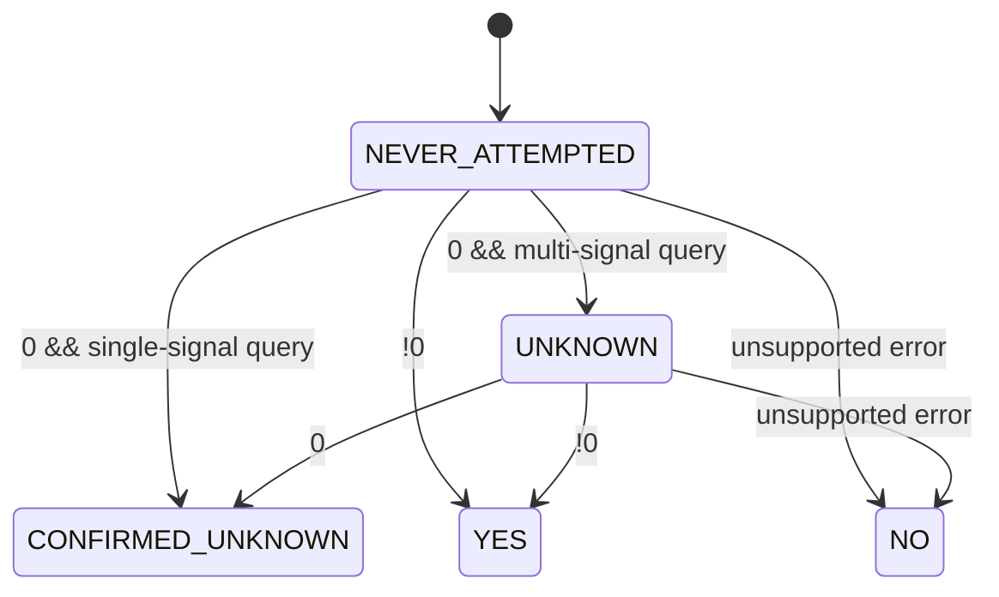

# Architecture

:warning: Outdated :warning:

### State machine for signal supported flag

Note: Sungrow inverters return 0 for unsupported signals when they are queried together with other signals. Therefore any 0 response is ambiguous and requires a follow-up query with only the signal in question.

