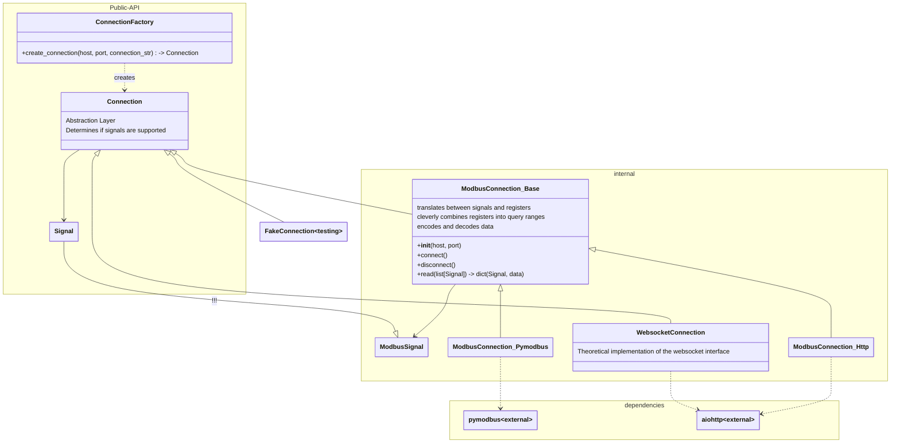
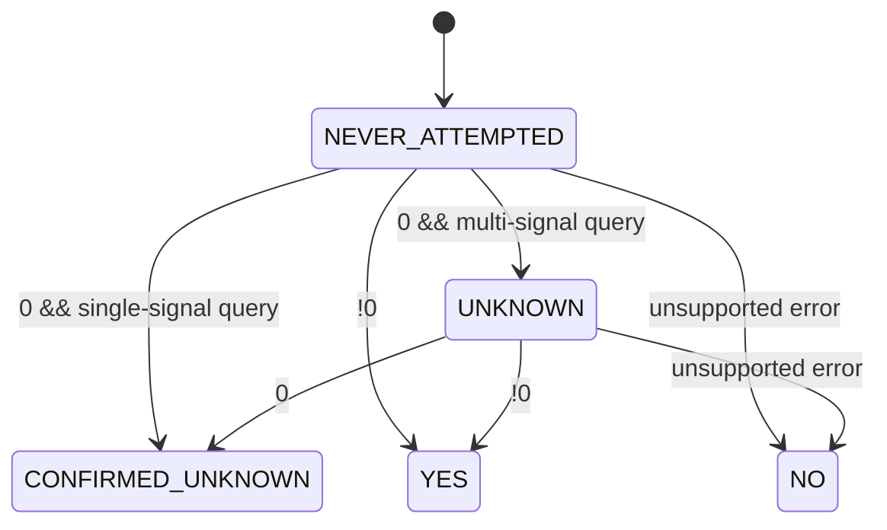

# sungrowlib
:warning: Just getting started... this will become a python abstraction for sungrow inverters

# Connection

sungrowlib is a "mid level" abstraction layer for accessing Sungrow inverters from python.

This project is on no way associated with Sungrow.

sungrowlib:
* provides a generic interface to connect to sungrow inverters
* supports modbus, http and websocket connections
* reads signals from the inverter (future: write)
* decodes the signals into human readable values
* detects which signals are supported
* handles the connection to the inverter (reconnects, token refreshes, etc)
* cleverly combine modbus queries into appropriate modbus ranges
* provide complex signals, such as date construction based on other signals

:construction: An open point is whether the library should provide a list of all supported signals or whether it should be up to the user to know which signals are supported. The latter would be more flexible, but the former would be more user-friendly.

`core.connection` is deliberately designed in a way that allows it to be extracted from the rest of this extension and used in other projects. It is a generic abstraction layer for connecting to sungrow inverters and reading signals from them.

Once everything has stabilized, it will be moved to its own repository.

## State machine for signal supported flag

Note: Sungrow inverters return 0 for unsupported signals when they are queried together with other signals. Therefore any 0 response is ambiguous and requires a follow-up query with only the signal in question.

## Comparable projects:
* [SungrowClient](https://github.com/bohdan-s/SungrowClient)
* todo

